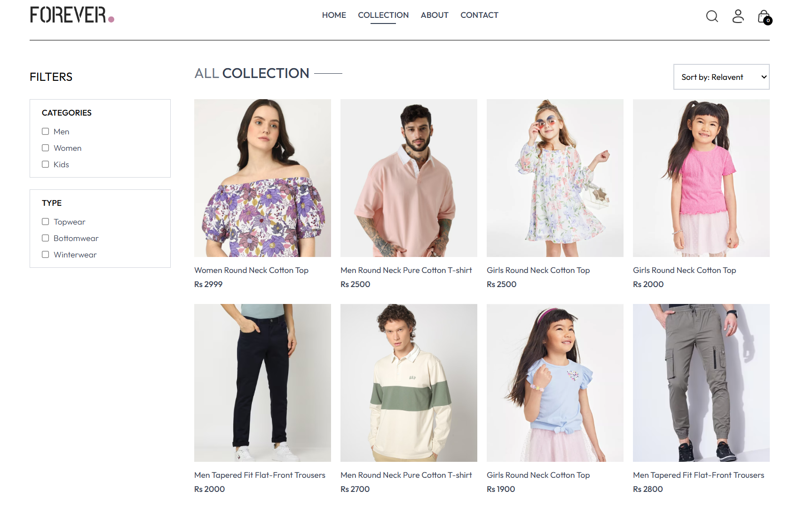

# 🛒 Forever - Full Stack MERN E-commerce Clothing Store

<div align="center">


A modern **full-stack e-commerce clothing website** built with **React**, **Node.js**, **Express**, **MongoDB**, and **Tailwind CSS**. Complete **online shopping platform** with user authentication, shopping cart, product filtering, and admin dashboard.

[](https://forever-frontend-tau-sooty.vercel.app/)
[](https://github.com/ARQUM21)
[](https://www.linkedin.com/in/muhammadarqumtariq/)

</div>

---

## 🔥 Keywords

> MERN Stack E-commerce | React Shopping Cart | Node.js E-commerce | Online Clothing Store | Full Stack Web Application | MongoDB E-commerce | React Tailwind E-commerce | JavaScript Shopping Website | Responsive E-commerce | Admin Dashboard | Product Management

---

## ✨ Features

### 🛍️ Customer Features
- 🔐 **User Authentication** - Secure Login & Registration
- 🛒 **Shopping Cart** - Add, Remove, Update Items
- ❤️ **Wishlist** - Save Favorite Products
- 🔍 **Smart Search** - Find Products Instantly
- 🏷️ **Category Filter** - Men, Women, Kids
- 👕 **Type Filter** - Topwear, Bottomwear, Winterwear
- 💰 **Price Sorting** - Low to High, High to Low
- 📦 **Order Placement** - Easy Checkout Process
- 📜 **Order History** - Track All Orders
- 💵 **Cash on Delivery** - Convenient Payment Option
- 📱 **Fully Responsive** - Mobile, Tablet, Desktop
- 🔔 **Toast Notifications** - Real-time Feedback
- 📧 **Newsletter Subscription** - Stay Updated

### 👨‍💼 Admin Features
- 📊 **Admin Dashboard** - Complete Control Panel
- ➕ **Add Products** - Upload New Items with Images
- 📋 **Product List** - View & Manage All Products
- 📦 **Order Management** - Track & Update Orders
- 🖼️ **Cloudinary Integration** - Cloud Image Storage

---

## 🛠️ Tech Stack

<div align="center">

| Frontend | Backend | Database | Styling | Tools |
|:--------:|:-------:|:--------:|:-------:|:-----:|
|  |  |  |  |  |
|  |  |  |  |  |

</div>

---

## 🚀 Live Demo

🔗 **[Visit Forever Store](https://forever-frontend-tau-sooty.vercel.app/)**

---

## 📸 Screenshots

### 🏠 Homepage


### 🛍️ Product Collection


### 📄 Product Details


### 🛒 Shopping Cart


### 👤 User Login


### 📦 Place Order


### 👨‍💼 Admin Dashboard


---

## ⚙️ Installation & Setup

### Prerequisites
- Node.js (v14 or higher)
- MongoDB
- Cloudinary Account

### 1. Clone the Repository

```bash
git clone https://github.com/ARQUM21/forever.git
cd forever

```
 
### 2. Install Dependencies

```bash
# Install Frontend Dependencies
cd frontend
npm install

# Install Backend Dependencies
cd ../backend
npm install

# Install Admin Dependencies
cd ../admin
npm install

```

### 3. Environment Variables
Create .env file in backend folder:

```bash
env

PORT=5000
MONGODB_URI=your_mongodb_connection_string
JWT_SECRET=your_jwt_secret_key
CLOUDINARY_CLOUD_NAME=your_cloudinary_name
CLOUDINARY_API_KEY=your_cloudinary_api_key
CLOUDINARY_API_SECRET=your_cloudinary_api_secret

```

Create .env file in frontend folder:
```bash
env

VITE_BACKEND_URL=http://localhost:5000
```

### 4. Run the Application
```Bash

# Run Backend
cd backend
npm run dev

# Run Frontend (new terminal)
cd frontend
npm run dev

# Run Admin (new terminal)
cd admin
npm run dev
```

### 5. Open in Browser

```text
Frontend: http://localhost:5173
Admin:    http://localhost:5174
Backend:  http://localhost:5000
```

### 📁 Folder Structure

```text
forever/
├── 📂 frontend/
│   ├── 📂 src/
│   │   ├── 📂 assets/
│   │   ├── 📂 components/
│   │   │   ├── Navbar.jsx
│   │   │   ├── Footer.jsx
│   │   │   ├── ProductItem.jsx
│   │   │   ├── LatestCollection.jsx
│   │   │   ├── BestSeller.jsx
│   │   │   ├── SearchBar.jsx
│   │   │   └── NewsLetterBox.jsx
│   │   ├── 📂 pages/
│   │   │   ├── Home.jsx
│   │   │   ├── Collection.jsx
│   │   │   ├── Product.jsx
│   │   │   ├── Cart.jsx
│   │   │   ├── Login.jsx
│   │   │   ├── PlaceOrder.jsx
│   │   │   ├── Orders.jsx
│   │   │   ├── About.jsx
│   │   │   └── Contact.jsx
│   │   ├── 📂 context/
│   │   │   └── ShopContext.jsx
│   │   └── App.jsx
│   └── package.json
│
├── 📂 backend/
│   ├── 📂 models/
│   ├── 📂 routes/
│   ├── 📂 controllers/
│   ├── 📂 middleware/
│   ├── server.js
│   └── package.json
│
├── 📂 admin/
│   ├── 📂 src/
│   │   ├── 📂 components/
│   │   ├── 📂 pages/
│   │   └── App.jsx
│   └── package.json
│
└── README.md
```


### Future Enhancements
 Payment Gateway Integration (Stripe/Razorpay)
 Email Notifications
 Product Reviews & Ratings
 Multiple Payment Options
 Discount Coupons
 Social Media Login

### 🤝 Contributing
Contributions are welcome! Feel free to open issues and pull requests.

```Bash

1. Fork the repository
2. Create your feature branch (git checkout -b feature/AmazingFeature)
3. Commit your changes (git commit -m 'Add some AmazingFeature')
4. Push to the branch (git push origin feature/AmazingFeature)
5. Open a Pull Request
```


---

## 📧 Contact

<div align="center">

**Muhammad Arqum Tariq**

[](https://github.com/ARQUM21)
[](https://www.linkedin.com/in/muhammadarqumtariq/)
[](mailto:marqum987@gmail.com)

</div>

---

## ⭐ Show Your Support

Give a ⭐ if you like this project!

---

## 📄 License

This project is licensed under the MIT License - see the [LICENSE](LICENSE) file for details.

---

<div align="center">

### Made with ❤️ by Muhammad Arqum Tariq


</div>
